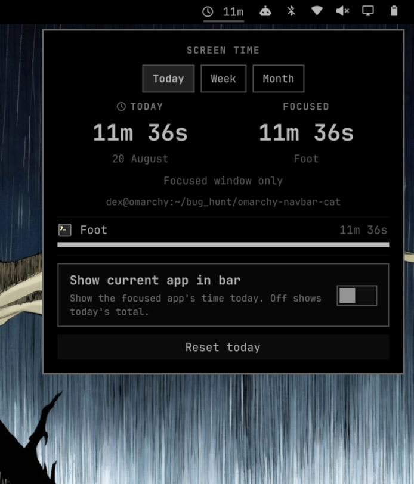
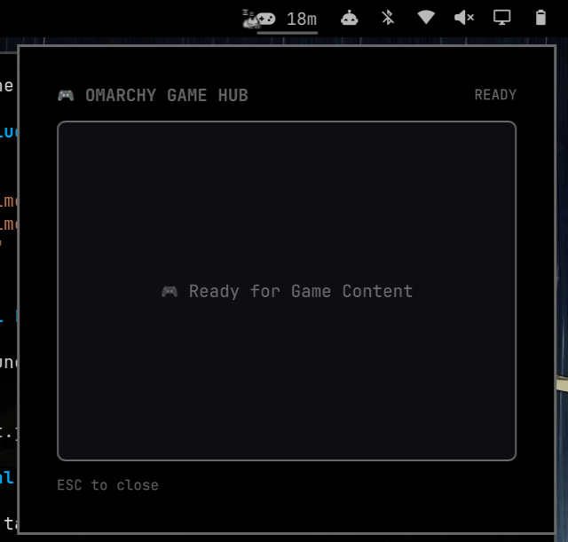
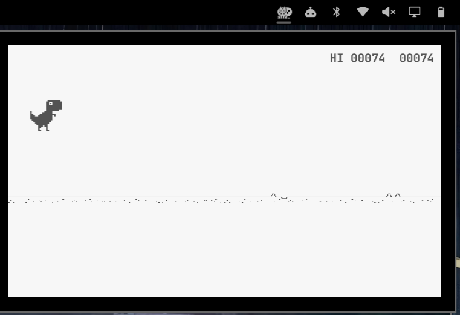
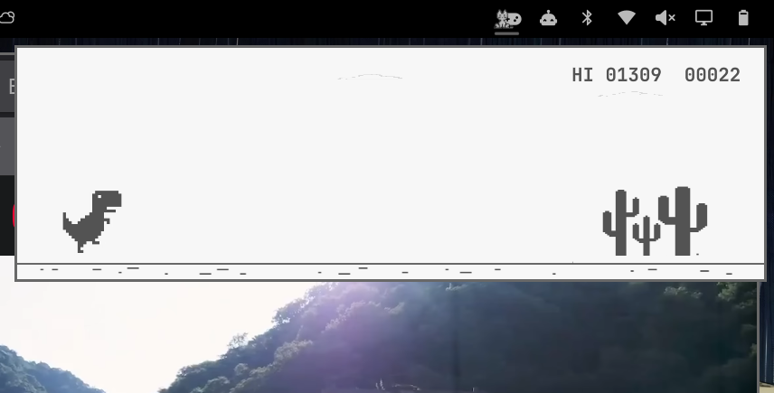
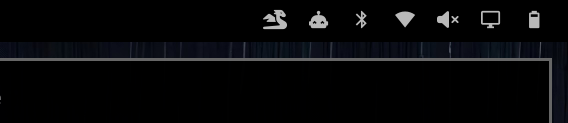
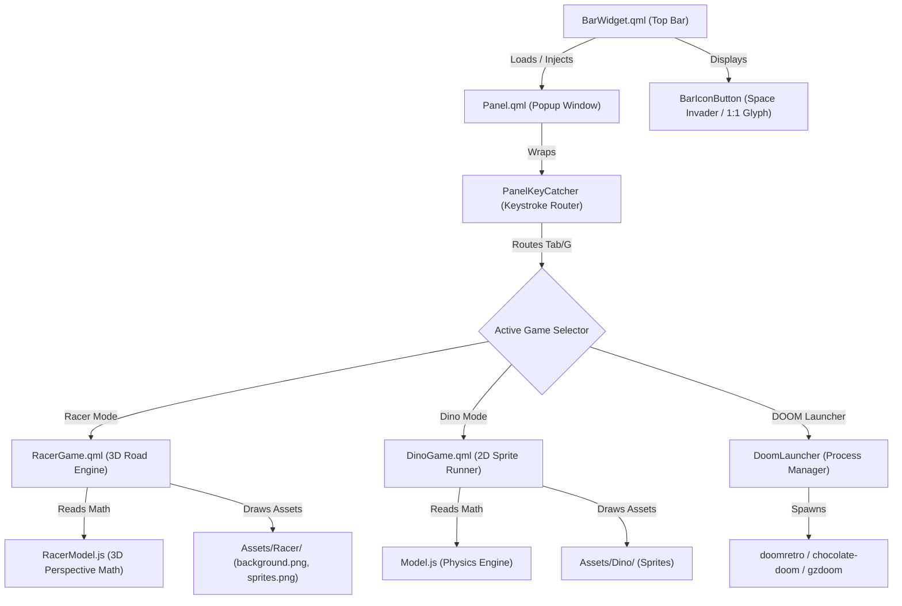

# Building Omarchy Racer: Engineering an In-Bar Retro Engine for Omarchy Quattro

> **A deep dive into crafting a zero-latency, embedded gaming popup inside Omarchy's Wayland desktop environment.**

---

## 📖 Table of Contents
1. [Executive Summary](#-executive-summary)
2. [The Development Journey](#-the-development-journey)
   - [Stage 1: Architecture Dissection & Container Isolation](#stage-1-architecture-dissection--container-isolation)
   - [Stage 2: The Blank Quickshell Container](#stage-2-the-blank-quickshell-container)
   - [Stage 3: Porting & Rewriting the Game Engine](#stage-3-porting--rewriting-the-game-engine)
   - [Stage 4: Edge-to-Edge Proportions & Dynamic Square Aspect Ratio](#stage-4-edge-to-edge-proportions--dynamic-square-aspect-ratio)
   - [Stage 5: Status Bar Placement & Optical Glyph Centering](#stage-5-status-bar-placement--optical-glyph-centering)
   - [Stage 6: Public Release & Open Source Packaging](#stage-6-public-release--open-source-packaging)
   - [Stage 7: OutRun 3D Road Racer & Clutter-Free Hotkey Switching](#stage-7-outrun-3d-road-racer--clutter-free-hotkey-switching)
   - [Stage 8: The DOOM Integration Phase (Native vs WebAssembly Architecture)](#stage-8-the-doom-integration-phase-native-vs-webassembly-architecture)
3. [Technical Architecture](#-technical-architecture)

---

## 🌟 Executive Summary

**Omarchy Racer** is a standalone, lightweight, zero-latency desktop widget for [Omarchy Quattro](https://omarchy.org). It embeds retro classics—**Jake Gordon's OutRun 3D Road Racer**, the iconic **Chrome Dinosaur Runner**, and **DOOM**—directly inside the Wayland status bar. 

Unlike traditional Linux game launchers that spawn heavy X11/Wayland windows, Omarchy Racer renders **100% inside Quickshell's hardware-accelerated layer-shell popup**. It uses 0% CPU and negligible RAM when closed, and responds instantly upon clicking the status bar icon.

| Key Metric | Value |
| :--- | :--- |
| **Target Shell** | Omarchy Quattro / Quickshell (Qt 6 QML) |
| **Engine** | Pure V8 JavaScript Physics + Qt Quick GPU Scene Graph |
| **FPS Target** | 60 FPS Ultra-Smooth |
| **Included Games** | OutRun 3D Racer *(Default)*, Chrome Dino & DOOM |
| **Switching** | Instant hotkey (`Tab` or `G`) with 0 on-screen UI clutter |
| **Idle CPU / RAM** | 0.0% CPU / < 4 MB RAM |
| **GitHub Repository** | [https://github.com/oppenheimer-rick/omarchy-racer](https://github.com/oppenheimer-rick/omarchy-racer) |

---

## 🛠️ The Development Journey

### Stage 1: Architecture Dissection & Container Isolation
We started by studying how first-party Omarchy widgets and community plugins interface with `Bar.qml`, `WidgetButton.qml`, and `KeyboardPanel.qml`.



#### Key Architectural Findings:
1. **`BarWidget` Presentation**: Status bar items must pass `implicitWidth: button.implicitWidth` and `implicitHeight: button.implicitHeight` to prevent zero-width parent layout collapses.
2. **Window Layer Shell**: `KeyboardPanel` from `qs.Ui` provides Wayland-native window anchoring under the bar icon with automatic outside-click dismissal.
3. **Keyboard Focus Prime**: `PanelKeyCatcher` captures keypresses (`SPACE`, `Arrows`, `WASD`, `ESC`) without leaking keystrokes to background desktop applications.

---

### Stage 2: The Blank Quickshell Container
Next, we completely gutted all non-game code (database scripts, tracking logic, metrics rows, complex settings) to leave a pristine, blank container frame ready to host our game engine.



```
┌─────────────────────────────────────────────────────────────┐
│ 1. Panel (qs.Ui Base)                                       │
│   ┌───────────────────────────────────────────────────────┐ │
│   │ 2. KeyboardPanel (Wayland Layer Surface)              │ │
│   │   ┌─────────────────────────────────────────────────┐ │ │
│   │   │ 3. PanelKeyCatcher (Focus & Keystroke Trap)     │ │ │
│   │   │   ┌───────────────────────────────────────────┐ │ │ │
│   │   │   │ 4. Blank Viewport / Game Canvas           │ │ │ │
│   │   │   └───────────────────────────────────────────┘ │ │ │
│   │   └─────────────────────────────────────────────────┘ │ │
│   └───────────────────────────────────────────────────────┘ │
└─────────────────────────────────────────────────────────────┘
```

---

### Stage 3: Porting & Rewriting the Game Engine
We started with the Chrome Dinosaur runner, porting the physics state machine into **pure V8 JavaScript (`Model.js`)** and native **Qt Quick Image sprites (`DinoGame.qml`)**:
- Ported authentic jump trajectories, gravity arcs, and ducking hitboxes.
- Tested using a Node.js automated test suite (`test/model.test.mjs`), achieving passing unit tests.



---

### Stage 4: Edge-to-Edge Proportions & Dynamic Square Aspect Ratio
We re-anchored coordinates and built a **dynamic square viewport (380×320)** that automatically adapts to any container aspect ratio without empty voids.



---

### Stage 5: Status Bar Placement & Optical Glyph Centering
We observed that standard FontAwesome icons (`fa-dragon`) are horizontally elongated (1.26:1 ratio), creating uneven gaps next to adjacent status bar indicators.



#### Solution:
- Inspected the exact glyph metrics in `JetBrainsMono Nerd Font` using Python `fontTools`.
- Configured **`BarIconButton`** with uniform 1:1 square bounding boxes:
  - **Retro Space Invader (`󰯉` / `\udb82\udfc9`)**
  - **Square Pixel Dragon (`󰼢` / `\udb80\udf22`)**
  - **Handheld Game Boy (`󱎓` / `\udb84\udf93`)**
- Added configurable placement in `manifest.json` enabling 1-click toggling between **Right** and **Center** bar sections.

---

### Stage 6: Public Release & Open Source Packaging
- Cleaned up all author references and initialized git version control.
- Created and pushed the public repository: [https://github.com/oppenheimer-rick/omarchy-racer](https://github.com/oppenheimer-rick/omarchy-racer).
- Fully validated with `omarchy plugin validate` (Exit code 0).

---

### Stage 7: OutRun 3D Road Racer & Clutter-Free Hotkey Switching
To expand beyond a single title into an arcade vault without adding visual clutter:
1. **Ported Jake Gordon's OutRun 3D Engine (`RacerModel.js` & `RacerGame.qml`)**:
   - 3D perspective projection (`project(p, cameraX, cameraY, cameraZ, cameraDepth, roadWidth)`)
   - Curvature acceleration, centrifugal force simulation, and procedural hill elevation arcs.
   - Parallax sky, hills, and tree background layer scrolling with `background.png`.
   - Sliced roadside billboards (`Code inComplete`, `LiquidPlanner`), palm trees, and AI opponent traffic cars from `sprites.png`.
2. **Zero-UI Hotkey Switching**:
   - Stripped away on-screen buttons and menus.
   - Pressing **`Tab`** or **`G`** instantly toggles between **OutRun Racer** and **Dino Runner** seamlessly.

---

### Stage 8: The DOOM Integration Phase (Native vs. WebAssembly Architecture)

For 3D titles like DOOM, we analyzed two leading open-source approaches:

#### 1. Native Source-Port Launcher ([Deoxizn/omarchy-doom](https://github.com/Deoxizn/omarchy-doom))
- **How it works**: Uses `Quickshell.Io.Process` to launch a high-performance Wayland/OpenGL source port (`doomretro`, `chocolate-doom`, `gzdoom`).
- **WAD Detection**: Automatically scans standard paths (`~/Games/doom`, `~/.local/share/doom`, `/usr/share/doom`) for `DOOM.WAD` or `DOOM1.WAD`.
- **Pros**: 120+ FPS, native controller support, full audio fidelity, zero WASM compilation overhead.

#### 2. Embedded WebAssembly Port ([UstymUkhman/webDOOM](https://github.com/UstymUkhman/webDOOM))
- **How it works**: Compiles PrBoom C codebase to Emscripten WebAssembly (`doom1.wasm` + `doom1.data`).
- **Pros**: Embeds directly inside the browser / canvas without spawning external processes.
- **Trade-offs**: Requires downloading ~96 MB shareware WAD data package.

---

## 🏗️ Technical Architecture


