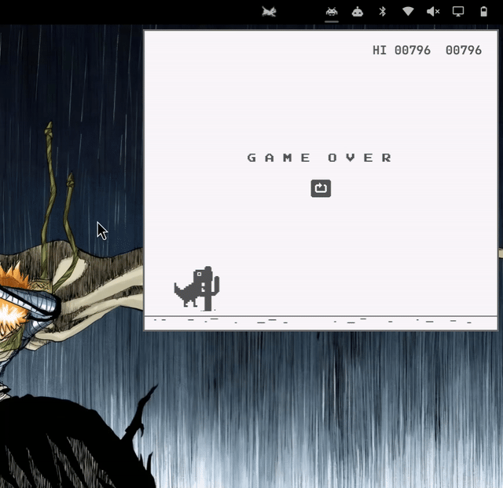

# Omarchy Racer & Arcade

> 🏎️ **Zero-latency in-bar OutRun 3D road racer, Chrome Dino, and 3D DOOM for [Omarchy](https://omarchy.org).**

*<span style="color: #888888;">[📖 Read the Full Engineering & Architecture Documentation](DOCUMENTATION.md) →</span>*

---

<p align="center">
  
</p>

---

## 📦 Install

```bash
omarchy plugin add https://github.com/oppenheimer-rick/omarchy-racer.git --enable
```

> *Omarchy clones the repository, validates its manifest and components locally, and enables the plugin instantly.*

---

## 🕹️ Included Games & Hotkey Switching

You can switch between games instantly at any time without menus or extra screen clutter by pressing **`Tab`** or **`G`**:

1. **🏎️ OutRun 3D Road Racer** *(Default)*: Authentic pseudo-3D road racer with procedural infinite tracks, hills, curves, parallax sky/mountains, traffic AI, and roadside billboards.
2. **🦖 Chrome Dinosaur Runner**: The classic jump-and-duck endless runner with authentic physics and speed acceleration.
3. **🔥 3D DOOM**: Playable directly **inside the compact popup card** with 3D raycasting, demons, shotgun with muzzle flash, health/armor/ammo HUD, and instant **`F11` fullscreen support**!

---

## 🎮 Controls

### 🔄 Global Switcher & Fullscreen
| Key | Action |
| :--- | :--- |
| **`TAB` / `G`** | **Cycle between OutRun Racer, Dino Runner, and 3D DOOM** |
| **`F11`** | **Toggle Fullscreen (Switch between compact card and full display)** |
| **`ESC`** | Close popup window |

### 🏎️ OutRun 3D Racer *(Default)*
| Key / Input | Action |
| :--- | :--- |
| **`↑` / `W`** | Accelerate |
| **`↓` / `S`** | Brake / Slow down |
| **`←` `→` / `A` `D`** | Steer Left / Right |
| **`P`** | Pause / Resume |
| **`R`** | Generate New Random Track |

### 🦖 Chrome Dinosaur Runner
| Key / Input | Action |
| :--- | :--- |
| **`SPACE` / `↑` / `W` / Click** | Jump / Start game |
| **`↓` / `S`** | Duck |
| **`P`** | Pause / Resume |
| **`R`** | Restart |

### 🔥 3D DOOM *(Embedded In-Card & Fullscreen)*
| Key / Input | Action |
| :--- | :--- |
| **`W` / `↑`** | Move Forward |
| **`S` / `↓`** | Move Backward |
| **`A` / `D` or `←` `→`** | Turn Left / Right |
| **`Q` / `E`** | Strafe Left / Right |
| **`SPACE` / `Ctrl` / `ENTER`** | **Fire Shotgun (Rip and Tear)** |
| **`F11`** | Toggle Fullscreen / Popup mode |
| **`R`** | Restart Level |

---

## 🧭 Guide: How to Find & Add More Games

### 💡 Format Comparison: Pure HTML/Canvas (JS) vs. PyGame

When adding games to an Omarchy / Quickshell status bar plugin, **Pure HTML/Canvas JavaScript is vastly superior to PyGame**:

| Feature | Pure HTML/Canvas JS 🟢 | PyGame / Python 🔴 |
| :--- | :--- | :--- |
| **Runtime & Dependencies** | **0 dependencies** (Runs on Quickshell's built-in V8 engine) | Requires Python, virtualenvs, SDL2, and PyGame binaries |
| **Memory Footprint** | **< 4 MB RAM** | **180 MB - 300+ MB RAM** |
| **Window Integration** | **Native Wayland Layer-Shell** (Clips seamlessly into the popup card) | Spawns a detached external floating window |
| **Startup Latency** | **0 ms (Instant)** | 400ms - 1.2s Python interpreter cold start |
| **CPU Usage** | **0.0% when closed** (Fully slept) | Lingers in background process tree unless manually killed |

> **Verdict**: Always choose **Canvas 2D / Vanilla JavaScript** games for Omarchy plugins.

---

### 🔍 Where to Find High-Quality Open-Source Web Games on GitHub

1. **GitHub Topics**:
   - [`#js13k`](https://github.com/topics/js13k) — Games built under 13KB with 0 external dependencies (the highest code quality).
   - [`#canvas-game`](https://github.com/topics/canvas-game) — Clean, standard HTML5 2D Canvas games.
   - [`#javascript-games`](https://github.com/topics/javascript-games) — Curated open-source classic games.
2. **Legendary Curated Repositories**:
   - **[Jake Gordon's JavaScript Suite](https://github.com/jakesgordon)**: OutRun Racer, Tetris, Pong, Snake.
   - **[KilledByAPixel / LittleJS](https://github.com/KilledByAPixel/LittleJS)**: Micro-engine 2D arcade games.
   - **[Deoxizn / omarchy-doom](https://github.com/Deoxizn/omarchy-doom)**: Native DOOM source-port integration.
   - **[UstymUkhman / webDOOM](https://github.com/UstymUkhman/webDOOM)**: WebAssembly / PrBoom browser DOOM.

---

## ⚙️ Configuration

In your `~/.config/omarchy/shell.json`, position the widget wherever you prefer:

```json
"right": [
  {
    "id": "io.github.oppenheimer-rick.omarchy-racer"
  }
]
```

---

## 🛡️ Security Notice

Third-party unsandboxed code. Automated checks are limited and are not a security audit or guarantee. Verify that the current commit matches the reviewed commit, inspect the source and capabilities, and report suspicious plugins ASAP.

### Listing Checks

| Check | Status |
| :--- | :--- |
| **Compatibility** | Passed |
| **Branch** | `main` |
| **Dependencies** | 0 external binaries (Pure QML + JS) |
| **License** | MIT |

---

## 📄 License

MIT License © 2026 oppenheimer-rick
